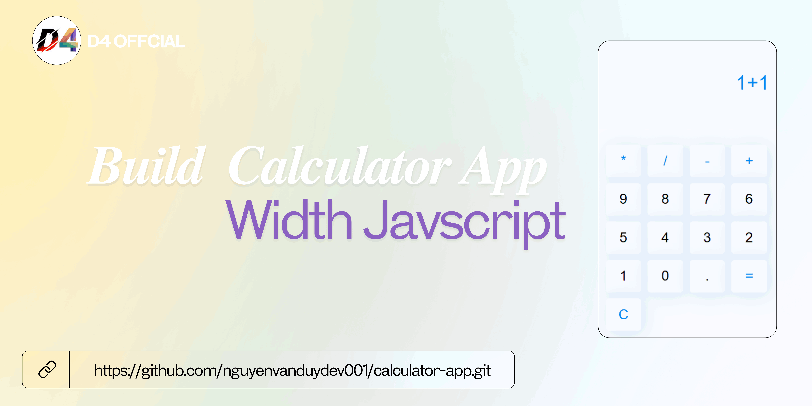

# Building a Calculator App Project With Javascript

## Demo


## Installation instructions

```
git clone https://github.com/nguyenvanduydev001/calculator-app.git
```
----

## What the project helps to learn
> Every computer user should experience developing a calculator because it is a programmer’s logic exercise that helps them better control user interaction. It builds a strong knowledge base in the essential programming basics, problem solving, and user interface design.

[Live demo](https://calculatar-nvd.netlify.app)
